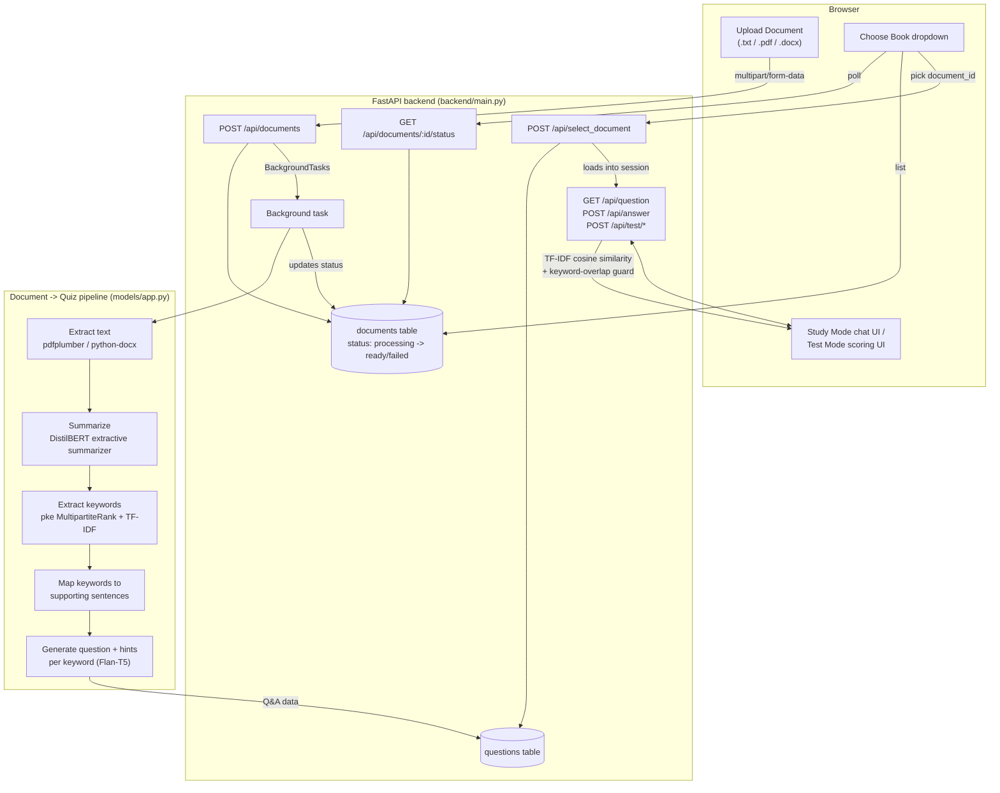
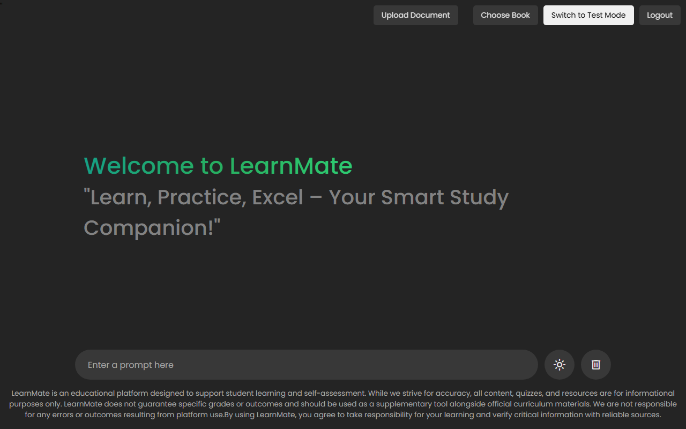
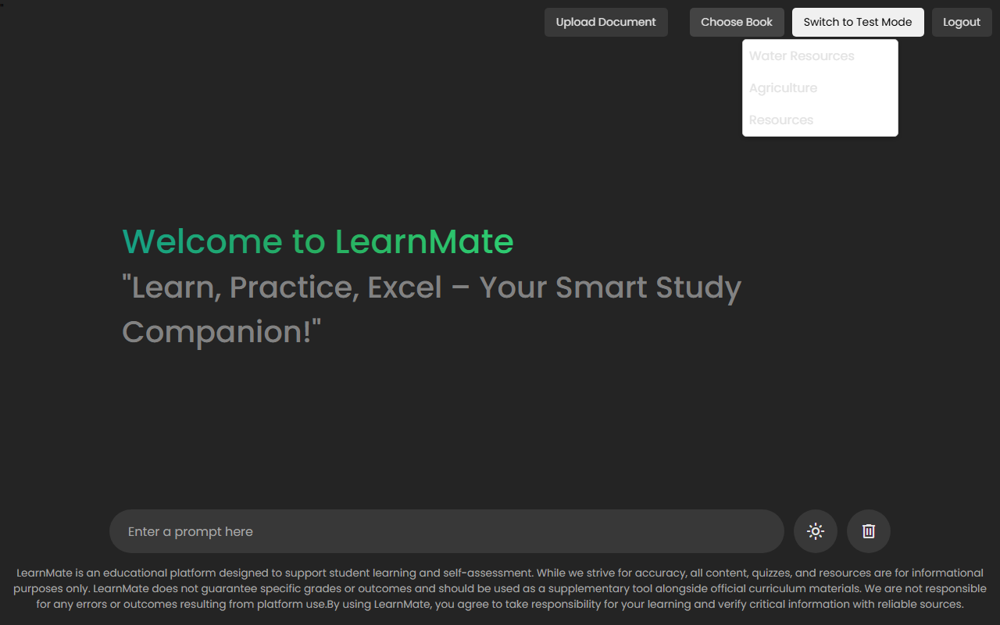
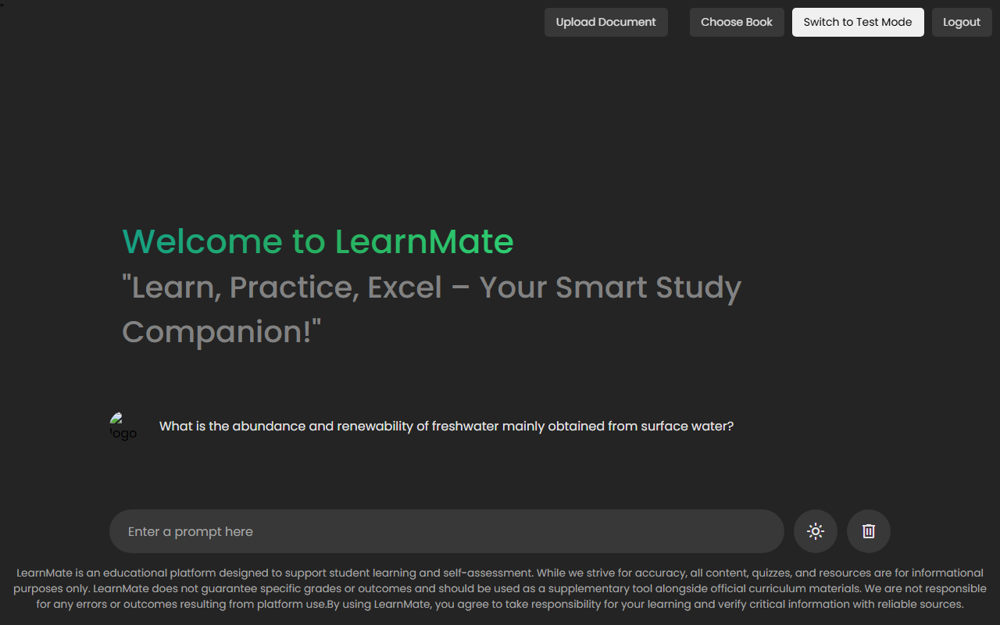
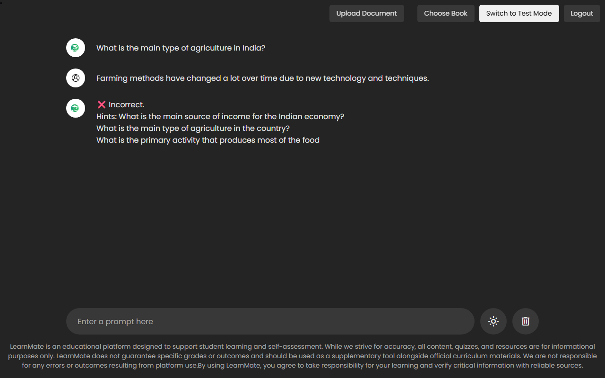

# LearnMate

LearnMate is a study companion that turns a document you upload — a textbook
chapter, lecture notes, any `.txt`/`.pdf`/`.docx` file — into an interactive
quiz. It extracts the key concepts, generates questions and hints for each
one, and then lets you answer them in a chat-style **Study Mode** (get
immediate feedback and hints) or a scored **Test Mode**.

## How it works



**In short:** upload → text extraction → BERT-based summarization → keyword
extraction (statistical, not just TF-IDF) → each keyword mapped back to the
sentences that support it → a small T5 model turns those sentences into a
question plus per-sentence hints. The result is stored per-document in
SQLite, so once processing finishes you can quiz yourself against it
immediately, or come back to it later — including the 3 example chapters
(Resources, Agriculture, Water Resources) that ship pre-loaded as seed
content.

Answers are graded with TF-IDF cosine similarity against the source
sentences, with a minimum-length floor and a keyword-overlap check so a
couple of stuffed keywords can't score as "correct."

## Screenshots

| Login | Sign up |
|---|---|
|  |  |

**Dashboard** — after signing in, before picking a document:



**Choosing a document** — the 3 seed chapters plus anything you've uploaded:



**Study Mode** — a generated question, ready to answer:



**Answering a question** — grading feedback with hints on an incorrect answer:



**Test Mode** — the same questions, scored:


## Features

- **Upload your own documents** (PDF, DOCX, TXT) and get a quiz generated
  from them — processed in the background so the upload returns immediately
  while generation runs, with a status you can poll.
- **Study Mode** — chat-style Q&A with hints and the correct answer shown
  when you're wrong or partially right.
- **Test Mode** — the same content as a scored quiz (5 marks per question,
  partial credit for hint-level matches).
- **Per-user accounts** — signup/login with hashed passwords and cookie
  sessions; each user's documents and quiz progress are their own.
- **3 example chapters included** (CBSE Geography: Resources, Agriculture,
  Water Resources) so there's something to try immediately after signing up.

## Architecture

```
frontend/       Static HTML/CSS/JS served by FastAPI (login, signup, dashboard/chat UI)
backend/
  main.py       FastAPI app: auth, document upload/status, quiz endpoints
  database.py   SQLite (aiosqlite): users, sessions, documents, questions
  document_parser.py   .txt / .pdf / .docx -> plain text
  seed_documents.py    One-time import of the 3 example chapters
  tests/        pytest suite (24+ tests, ML pipeline mocked out)
models/
  app.py        The actual NLP pipeline: generate_qa_from_text(text) -> dict
environment.yml Recommended conda environment (see Setup below)
```

## Setup

**Use conda, not plain pip.** On at least one Windows dev machine, pip-installed
PyTorch and `sentencepiece` crashed (DLL load failure / native segfault) due to
a corrupted system Visual C++ runtime that a redistributable reinstall
couldn't fully fix. Conda-forge's builds bundle their own C++ runtime and
avoid the issue entirely.

```bash
conda env create -f environment.yml
conda activate learnmate

# One-time downloads for the NLP pipeline:
python -m spacy download en_core_web_sm
python -c "import nltk; nltk.download('stopwords'); nltk.download('punkt'); \
    nltk.download('punkt_tab'); nltk.download('wordnet'); nltk.download('omw-1.4')"

# Not available on conda-forge, installed via pip inside the conda env:
pip install bert-extractive-summarizer "git+https://github.com/boudinfl/pke.git" flashtext
```

### Running it

```bash
cd backend
python main.py
# or: python -m uvicorn main:app --host 0.0.0.0 --port 8000
```

Then open `http://localhost:8000`.

### Running the tests

```bash
cd backend
python -m pytest tests/ -v
```

The test suite mocks out the ML pipeline (torch/transformers aren't needed to
run it), so it exercises auth, per-user document scoping, upload validation,
the quiz flow, and the grading edge cases quickly and deterministically.

## Notes on model choice

`models/app.py` uses `flan-t5-base` and `distilbert-base-uncased` rather than
the larger `flan-t5-large` / `bert-large-uncased`. This keeps the pipeline's
model memory footprint to ~1.3GB instead of ~4.3GB, which matters on modest
hardware (confirmed working end-to-end on an 8GB RAM machine — 15 questions
generated from a 16KB sample document in under a minute). Swap back to the
`-large` variants in `_load_model()` and `summarize_text()` if you're running
on a machine with more headroom, for somewhat higher-quality output.

## Known limitations

- Answer grading (TF-IDF cosine similarity) is a reasonable low-cost approach
  but doesn't understand paraphrasing the way a sentence-embedding model
  would; that upgrade is possible but wasn't done here since it also needs
  PyTorch.
- No malicious-file hardening beyond size cap, extension allowlist, and a
  magic-byte content check — good enough for personal/trusted use, not for
  accepting uploads from the public internet.
- Generated question quality depends on the underlying document having
  clear, extractable factual sentences; very short or very unstructured text
  won't produce much.
